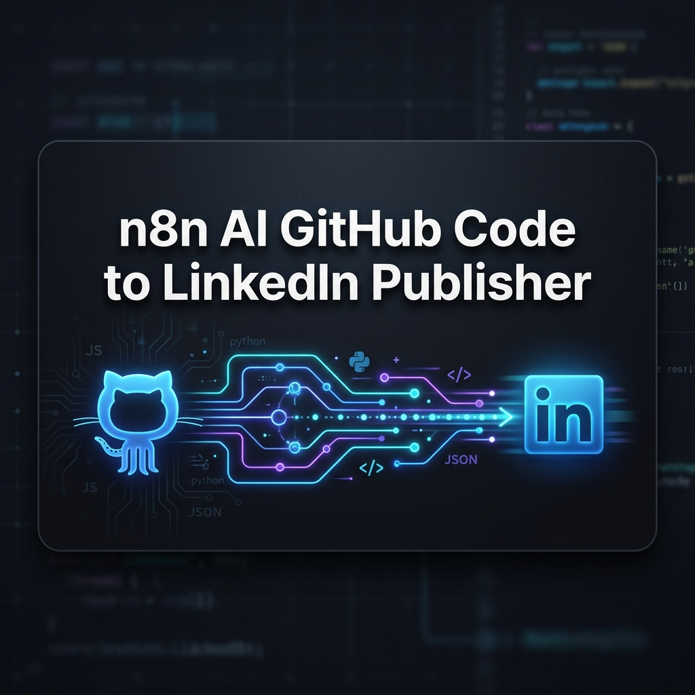
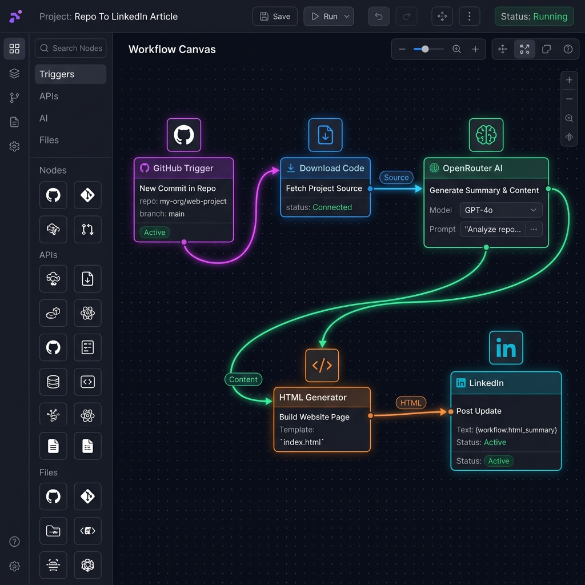
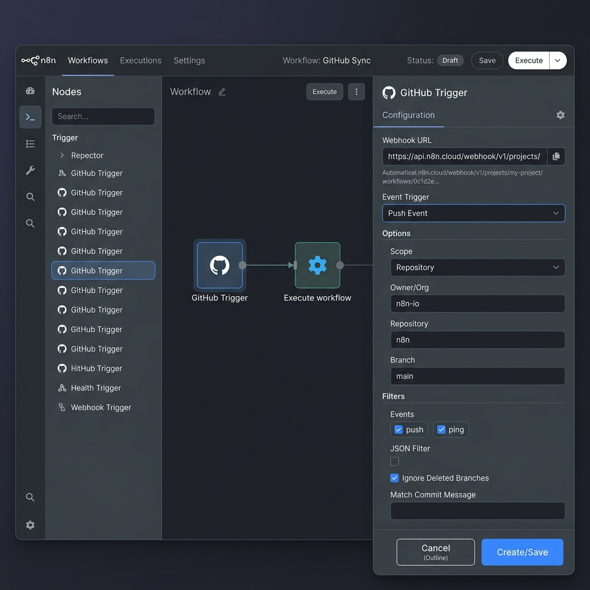
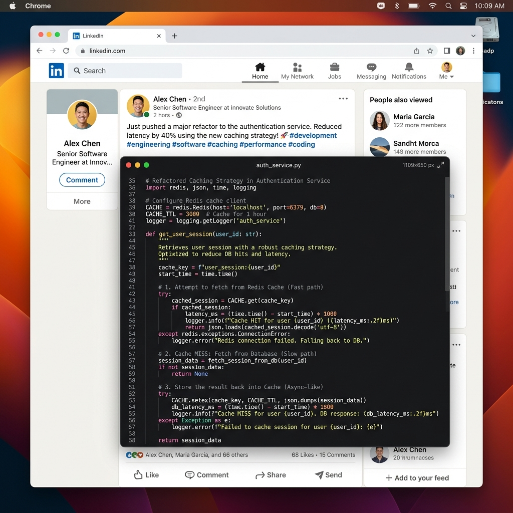
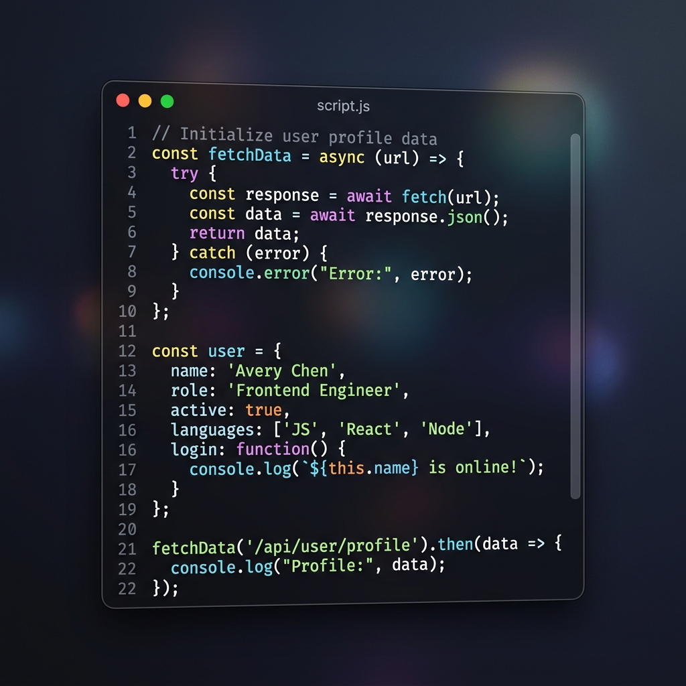
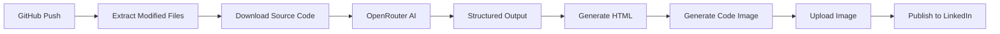

# n8n AI GitHub Code to LinkedIn Publisher




Automatically convert GitHub commits into AI-generated LinkedIn posts with syntax-highlighted code images using n8n, OpenRouter, GitHub, and LinkedIn.

---

## Why This Project?

Developers often build interesting projects but rarely share them consistently. This workflow bridges that gap by automatically transforming meaningful GitHub commits into professional LinkedIn posts, helping developers build a stronger technical presence with minimal effort.

## Demo


*(Add a demo GIF here showing a code push resulting in a LinkedIn post)*

## Workflow Information

- **Version**: 1.0.0
- **n8n Version**: >= 1.100
- **Nodes**: 22
- **Integrations**: 5
- **AI Models**: OpenRouter Compatible (Gemini 2.5 Flash recommended)
- **License**: MIT
- **Author**: Rishvin Reddy

## Supported Integrations

| Service | Status |
| :--- | :---: |
| GitHub | ✅ |
| LinkedIn | ✅ |
| OpenRouter | ✅ |
| Gemini | ✅ |
| HCTI | ✅ |
| n8n | ✅ |

## Gallery

| Workflow Overview | GitHub Trigger |
| :---: | :---: |
|  |  |

| Generated Post | Code Snippet |
| :---: | :---: |
|  |  |

## Architecture



## Repository Structure

```text
.
├── workflow/
│   └── n8n-ai-github-code-to-linkedin-publisher.json
├── docs/
│   ├── architecture.md
│   ├── credentials.md
│   ├── customization.md
│   ├── setup.md
│   └── troubleshooting.md
├── screenshots/
│   ├── workflow-overview.png
│   ├── github-trigger.png
│   ├── linkedin-post.png
│   └── generated-code-image.png
├── assets/
│   ├── banner.png
│   └── logo.png
├── examples/
│   ├── mock-github-webhook.json
│   └── test-webhook.sh
├── README.md
├── CHANGELOG.md
├── LICENSE
└── .env.example
```

## Getting Started

1. Clone this repository or download the latest release.
2. Review the detailed setup instructions in [docs/setup.md](docs/setup.md).
3. Import `workflow/n8n-ai-github-code-to-linkedin-publisher.json` into your n8n instance.
4. Set up the required credentials and configure the placeholder variables.

## Future Plans

- [ ] Pull Request Support
- [ ] Commit Batching
- [ ] Multiple Images
- [ ] Markdown Parsing
- [ ] Repository Statistics
- [ ] Better Error Handling
- [ ] Retry Logic
- [ ] Docker Support
- [ ] Dev.to Publishing
- [ ] Medium Publishing
- [ ] Threads Integration
- [ ] X (Twitter) Integration

## Contributing

Contributions are welcome! Please feel free to submit a Pull Request.

## License

This project is licensed under the MIT License - see the [LICENSE](LICENSE) file for details.
