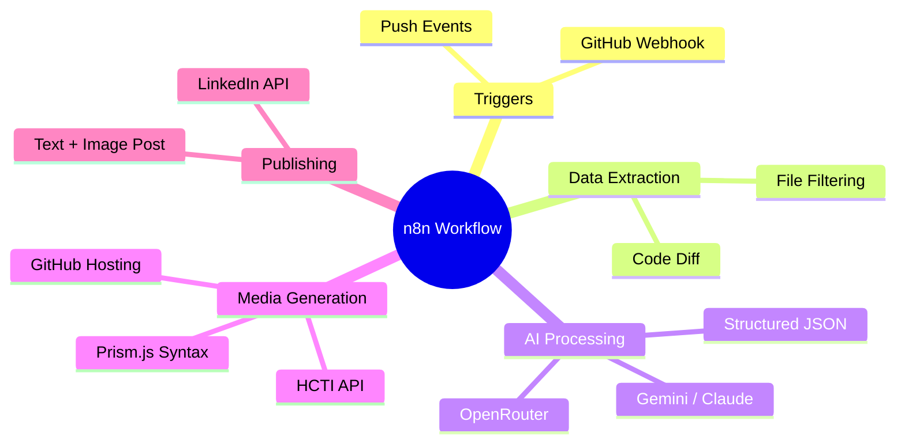
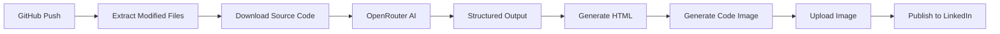
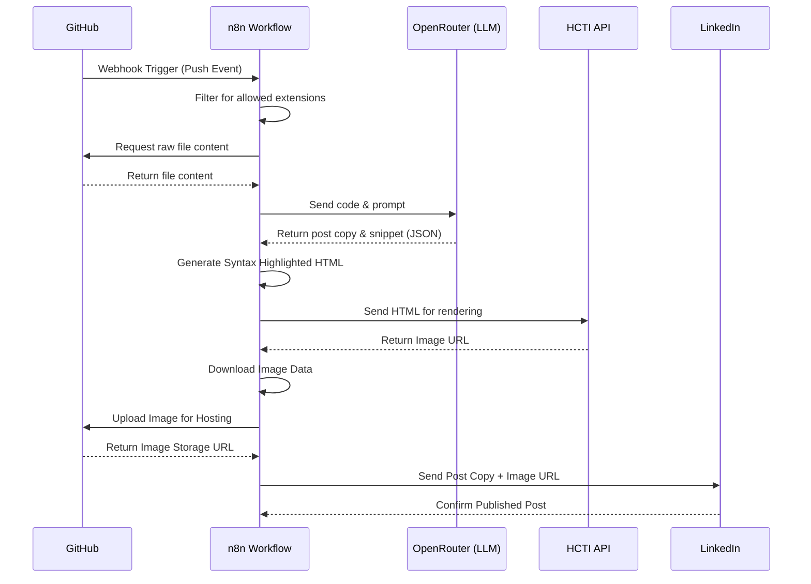
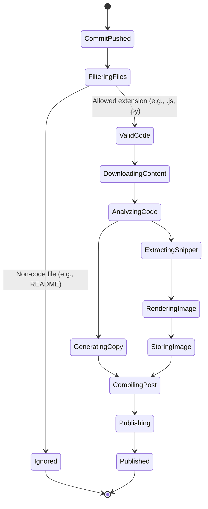
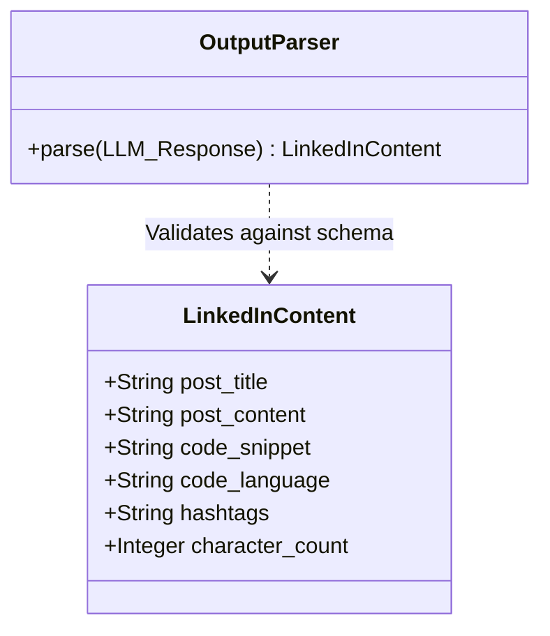
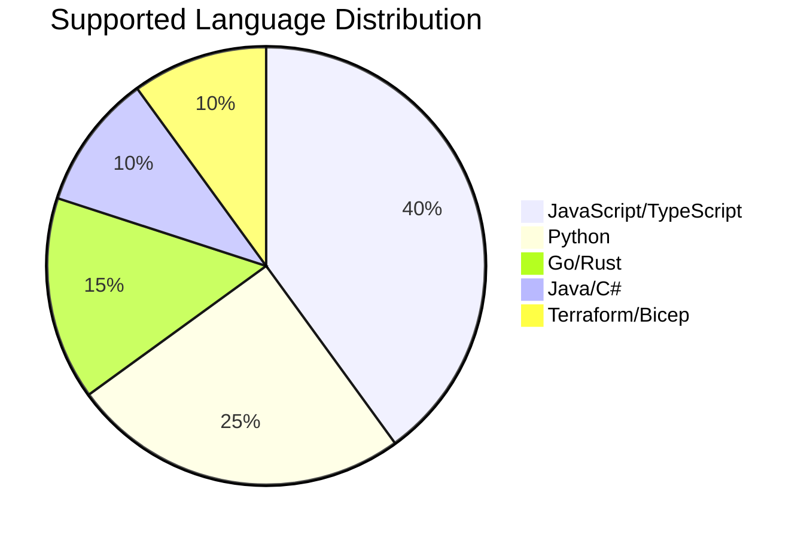
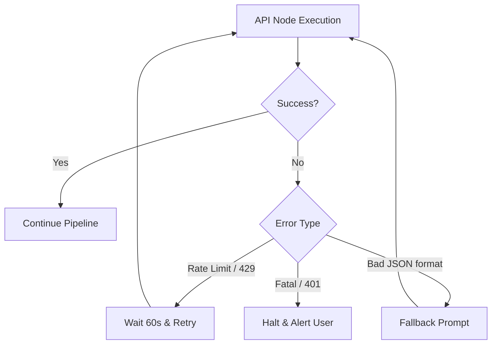
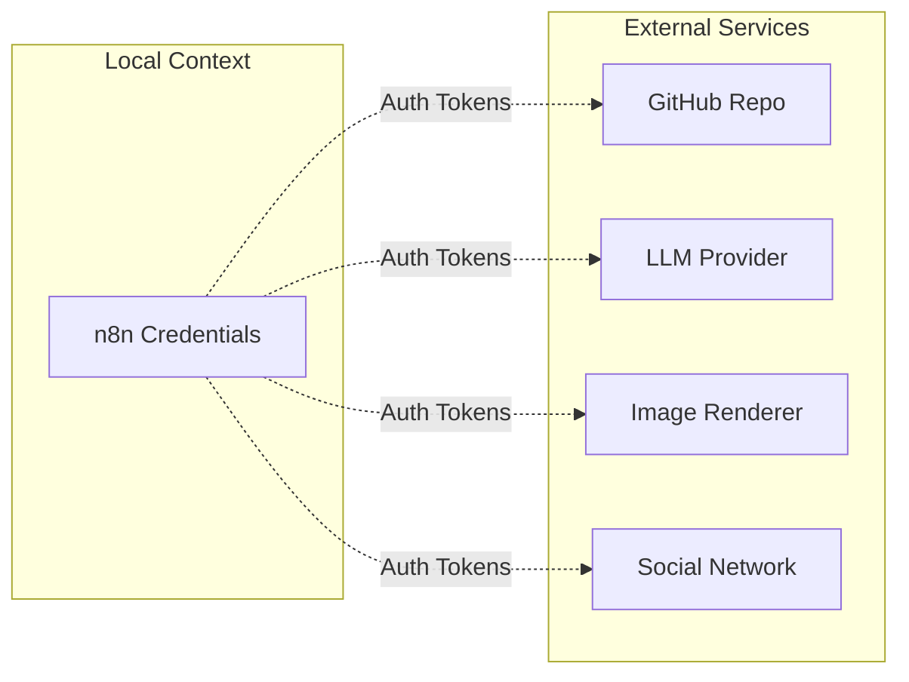

# n8n AI GitHub Code to LinkedIn Publisher


Automatically convert GitHub commits into AI-generated LinkedIn posts with syntax-highlighted code images using n8n, OpenRouter, GitHub, and LinkedIn.

Created by **Rishvin Reddy**

If this workflow helps you, consider starring the repository.

---

## Overview

This n8n workflow monitors your GitHub repositories for new commits, extracts the modified code, analyzes it using an AI model (OpenRouter), and generates an engaging, professional LinkedIn post complete with a syntax-highlighted image of the most important code snippet.



## Why This Project?

Developers often build interesting projects but rarely share them consistently. This workflow bridges that gap by automatically transforming meaningful GitHub commits into professional LinkedIn posts, helping developers build a stronger technical presence with minimal effort.

## Demo


*(Add a demo GIF here showing a code push resulting in a LinkedIn post)*

## Workflow Information

- **Version**: 1.0.0
- **n8n Version**: >= 1.100
- **Nodes**: 22
- **Integrations**: 5
- **AI Models**: OpenRouter Compatible (Gemini 2.5 Flash recommended)
- **License**: MIT
- **Author**: Rishvin Reddy

## Supported Integrations

| Service | Status |
| :--- | :---: |
| GitHub | ✅ |
| LinkedIn | ✅ |
| OpenRouter | ✅ |
| Gemini | ✅ |
| HCTI | ✅ |
| n8n | ✅ |

## Gallery

| Workflow Overview | GitHub Trigger |
| :---: | :---: |
|  |  |

| Generated Post | Code Snippet |
| :---: | :---: |
|  |  |


## Features

| Feature | Supported |
| :--- | :---: |
| GitHub Push Trigger | Yes |
| AI Content Generation | Yes |
| Code Snippet Extraction | Yes |
| Syntax Highlighting | Yes |
| LinkedIn Publishing | Yes |
| Multi-language Support | Yes |
| Commit Batching | Planned |
| Pull Request Events | Planned |
| Release Notes | Planned |

## Architecture

The system operates entirely within the n8n automation engine, communicating with external APIs to fetch data, generate AI content, render images, and publish the final result.

### 1. High-Level Flowchart



### 2. Sequence Diagram

This sequence diagram illustrates the chronological execution of API calls and data handoffs.



### 3. State Machine Diagram

This diagram represents the state transitions of a code commit as it passes through the automation pipeline.



## Deep Dive: AI Processing Pipeline

The core intelligence of this workflow lies in the LangChain Structured Output Parser inside n8n. It enforces a strict schema on the LLM to ensure reliable, parsable data for downstream nodes.



## Supported Languages

The workflow automatically detects and syntax-highlights a wide variety of programming languages. While any text-based code file can be processed, the default filter includes standard modern languages.



## Error Handling & Retry Strategies

To ensure maximum reliability, especially when dealing with rate-limited APIs, the workflow implements structural error handling.



## Use Cases

- **Personal Branding:** Maintain an active, professional presence on LinkedIn without manual effort.
- **Developer Portfolios:** Automatically showcase your open-source contributions and side projects to recruiters and peers.
- **Team Updates:** Share technical updates and interesting snippets from your company's repositories directly to your corporate LinkedIn page.
- **Educational Content:** Create a steady stream of bite-sized code tutorials based on your daily commits.

## Data Flow & Security

The workflow relies on several external APIs. Data is passed securely using HTTPS, and no credentials are hardcoded within the workflow itself.



**Security Considerations:**
- Use dedicated API keys scoped with minimum privileges (e.g., GitHub tokens restricted only to necessary repositories).
- All AI processing occurs via OpenRouter; refer to your selected model's data privacy policies.
- Ensure your n8n instance is secured behind a firewall or authentication proxy if hosted publicly.

## Repository Structure

```text
.
├── workflow/
│   └── n8n-ai-github-code-to-linkedin-publisher.json
├── docs/
│   ├── architecture.md
│   ├── credentials.md
│   ├── customization.md
│   ├── setup.md
│   └── troubleshooting.md
├── screenshots/
│   ├── workflow-overview.png
│   ├── github-trigger.png
│   ├── linkedin-post.png
│   └── generated-code-image.png
├── assets/
│   ├── banner.png
│   └── logo.png
├── examples/
│   ├── mock-github-webhook.json
│   └── test-webhook.sh
├── README.md
├── CHANGELOG.md
├── LICENSE
└── .env.example
```

## Requirements

- **n8n**: Version `1.100` or higher
- **GitHub**: Account with Personal Access Token (Classic)
- **LinkedIn**: Developer App with "Share on LinkedIn" access
- **OpenRouter**: API Key for LLM access
- **HCTI**: Account for HTML-to-Image generation

## Getting Started

1. Clone this repository or download the latest release.
2. Review the detailed setup instructions in [docs/setup.md](docs/setup.md).
3. Import `workflow/n8n-ai-github-code-to-linkedin-publisher.json` into your n8n instance.
4. Set up the required credentials and configure the placeholder variables.

## Documentation

- [Setup Guide](docs/setup.md)
- [Architecture Details](docs/architecture.md)
- [Credentials Configuration](docs/credentials.md)
- [Troubleshooting](docs/troubleshooting.md)
- [Customization](docs/customization.md)

## Future Plans

- [ ] Pull Request Support
- [ ] Commit Batching
- [ ] Multiple Images
- [ ] Markdown Parsing
- [ ] Repository Statistics
- [ ] Better Error Handling
- [ ] Retry Logic
- [ ] Docker Support
- [ ] Dev.to Publishing
- [ ] Medium Publishing
- [ ] Threads Integration
- [ ] X (Twitter) Integration

## Contributing

Contributions are welcome! Please feel free to submit a Pull Request.

## License

This project is licensed under the MIT License - see the [LICENSE](LICENSE) file for details.
