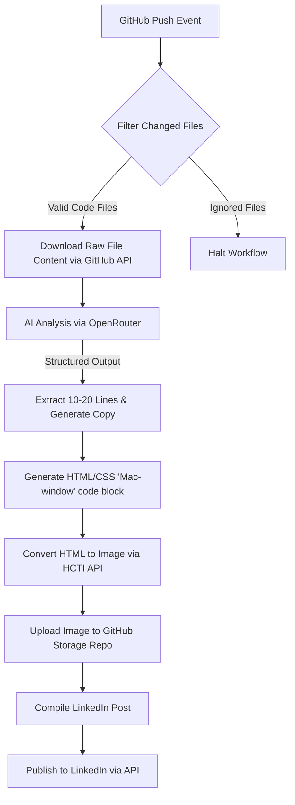
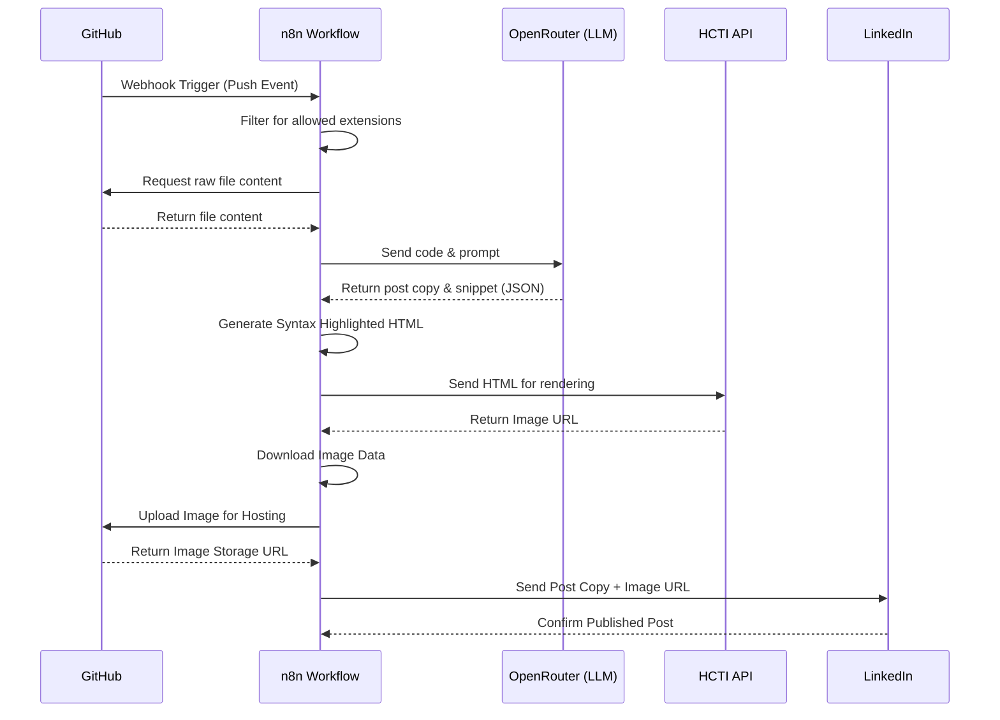
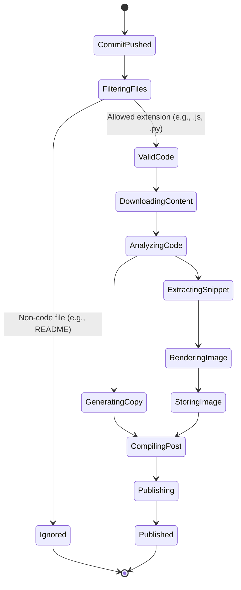
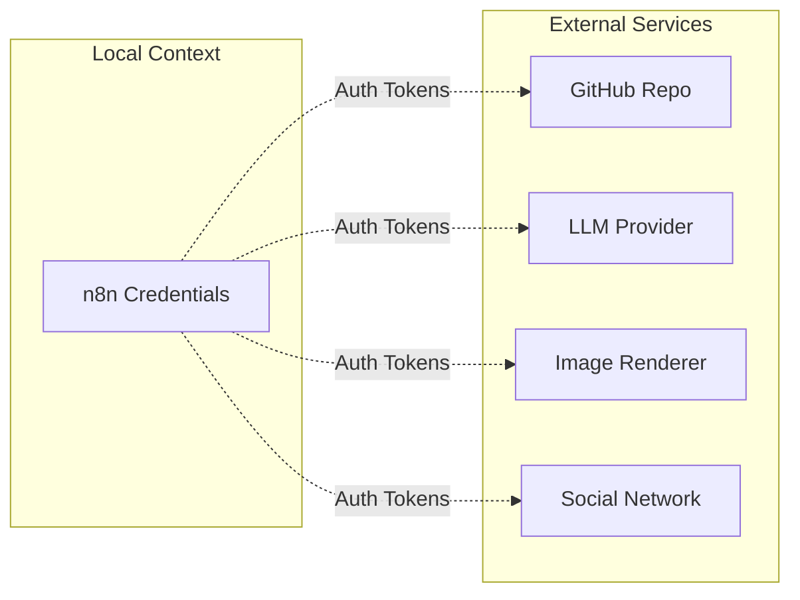

# n8n AI GitHub Code to LinkedIn Publisher

Automatically transform GitHub commits into AI-generated LinkedIn posts with beautiful code images using n8n, OpenRouter, GitHub, and LinkedIn.

Created by **Rishvin Reddy**

If this workflow helps you, consider starring the repository.

---

## Overview

This n8n workflow monitors your GitHub repositories for new commits, extracts the modified code, analyzes it using an AI model (OpenRouter), and generates an engaging, professional LinkedIn post complete with a syntax-highlighted image of the most important code snippet.

## Features

| Feature | Supported |
| :--- | :---: |
| GitHub Push Trigger | Yes |
| AI Content Generation | Yes |
| Code Snippet Extraction | Yes |
| Syntax Highlighting | Yes |
| LinkedIn Publishing | Yes |
| Multi-language Support | Yes |
| Commit Batching | Planned |
| Pull Request Events | Planned |
| Release Notes | Planned |

## Architecture

The system operates entirely within the n8n automation engine, communicating with external APIs to fetch data, generate AI content, render images, and publish the final result.

### 1. High-Level Flowchart

### 2. Sequence Diagram

This sequence diagram illustrates the chronological execution of API calls and data handoffs.

### 3. State Machine Diagram

This diagram represents the state transitions of a code commit as it passes through the automation pipeline.

## Use Cases

- **Personal Branding:** Maintain an active, professional presence on LinkedIn without manual effort.
- **Developer Portfolios:** Automatically showcase your open-source contributions and side projects to recruiters and peers.
- **Team Updates:** Share technical updates and interesting snippets from your company's repositories directly to your corporate LinkedIn page.
- **Educational Content:** Create a steady stream of bite-sized code tutorials based on your daily commits.

## Data Flow & Security

The workflow relies on several external APIs. Data is passed securely using HTTPS, and no credentials are hardcoded within the workflow itself.

**Security Considerations:**
- Use dedicated API keys scoped with minimum privileges (e.g., GitHub tokens restricted only to necessary repositories).
- All AI processing occurs via OpenRouter; refer to your selected model's data privacy policies.
- Ensure your n8n instance is secured behind a firewall or authentication proxy if hosted publicly.

## Requirements

- **n8n**: Version `1.100` or higher
- **GitHub**: Account with Personal Access Token (Classic)
- **LinkedIn**: Developer App with "Share on LinkedIn" access
- **OpenRouter**: API Key for LLM access
- **HCTI**: Account for HTML-to-Image generation

## Getting Started

1. Clone this repository or download the latest release.
2. Review the detailed setup instructions in [docs/setup.md](docs/setup.md).
3. Import `workflow/n8n-ai-github-code-to-linkedin-publisher.json` into your n8n instance.
4. Set up the required credentials and configure the placeholder variables.

## Documentation

- [Setup Guide](docs/setup.md)
- [Architecture Details](docs/architecture.md)
- [Credentials Configuration](docs/credentials.md)
- [Troubleshooting](docs/troubleshooting.md)
- [Customization](docs/customization.md)

## Roadmap

- [ ] Commit batching
- [ ] PR support
- [ ] Release notes
- [ ] Multi-image carousel

## Contributing

Contributions are welcome! Please feel free to submit a Pull Request.

## License

This project is licensed under the MIT License - see the [LICENSE](LICENSE) file for details.
