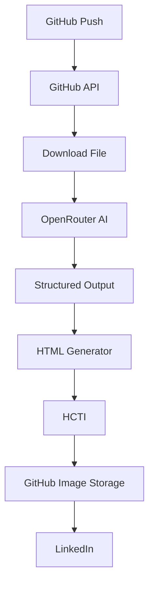

# 🚀 n8n AI GitHub Code to LinkedIn Publisher

Automatically transform GitHub commits into AI-generated LinkedIn posts with beautiful code images using n8n, OpenRouter, GitHub, and LinkedIn.

Created by **Rishvin Reddy**

⭐ If this workflow helps you, consider starring the repository!

---

## 📖 Overview

This n8n workflow monitors your GitHub repositories for new commits, extracts the modified code, analyzes it using an AI model (OpenRouter), and generates an engaging, professional LinkedIn post complete with a syntax-highlighted image of the most important code snippet.

## ✨ Features

| Feature | Supported |
| :--- | :---: |
| GitHub Push Trigger | ✅ |
| AI Content Generation | ✅ |
| Code Snippet Extraction | ✅ |
| Syntax Highlighting | ✅ |
| LinkedIn Publishing | ✅ |
| Multi-language Support | ✅ |
| Commit Batching | 🚧 |
| Pull Request Events | 🚧 |
| Release Notes | 🚧 |

## 🏗️ Architecture

## 🛠️ Requirements

- **n8n**: Version `1.100` or higher
- **GitHub**: Account with Personal Access Token (Classic)
- **LinkedIn**: Developer App with "Share on LinkedIn" access
- **OpenRouter**: API Key for LLM access
- **HCTI**: Account for HTML-to-Image generation

## 🚀 Getting Started

1. Clone this repository or download the latest release.
2. Review the detailed setup instructions in [docs/setup.md](docs/setup.md).
3. Import `workflow/n8n-ai-github-code-to-linkedin-publisher.json` into your n8n instance.
4. Set up the required credentials and configure the placeholder variables.

## 📁 Documentation

- [Setup Guide](docs/setup.md)
- [Architecture Details](docs/architecture.md)
- [Credentials Configuration](docs/credentials.md)
- [Troubleshooting](docs/troubleshooting.md)
- [Customization](docs/customization.md)

## 🗺️ Roadmap

- [ ] Commit batching
- [ ] PR support
- [ ] Release notes
- [ ] Multi-image carousel

## 🤝 Contributing

Contributions are welcome! Please feel free to submit a Pull Request.

## 📄 License

This project is licensed under the MIT License - see the [LICENSE](LICENSE) file for details.
